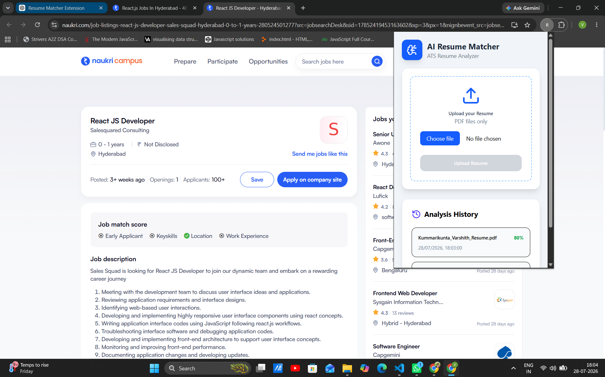
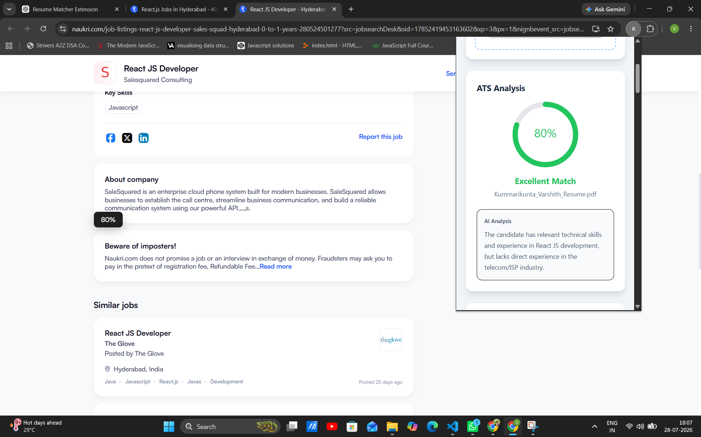
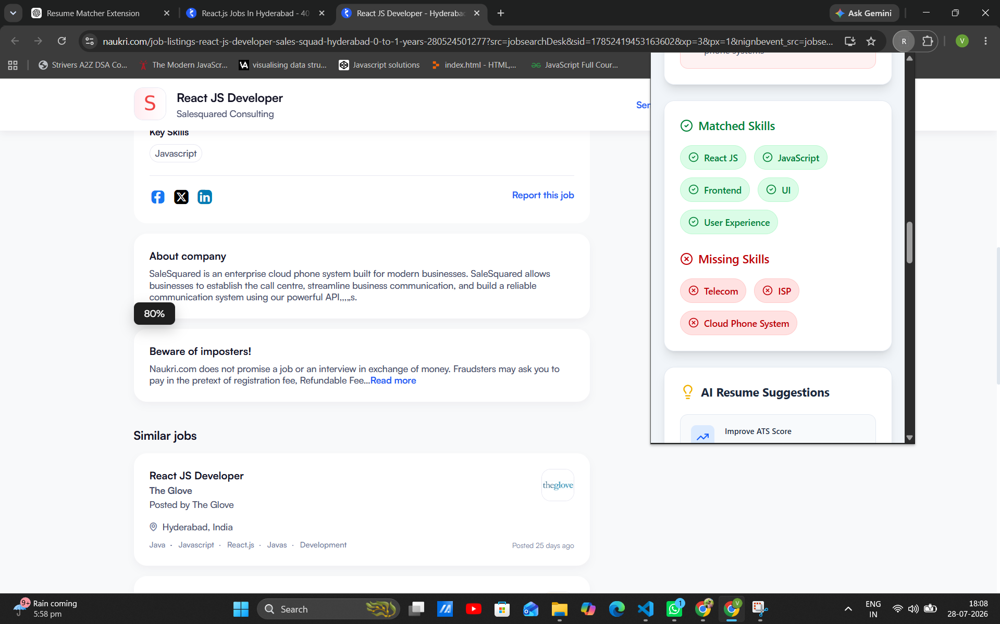
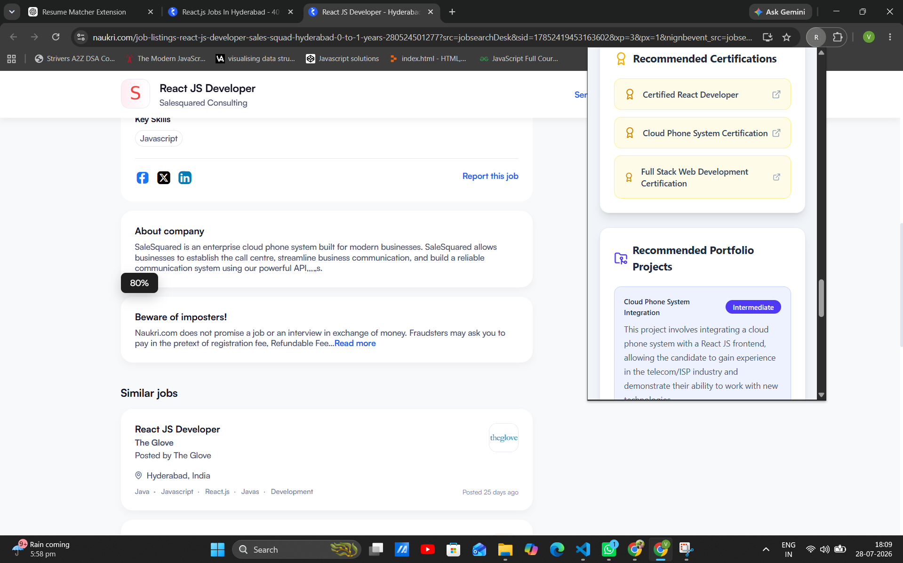
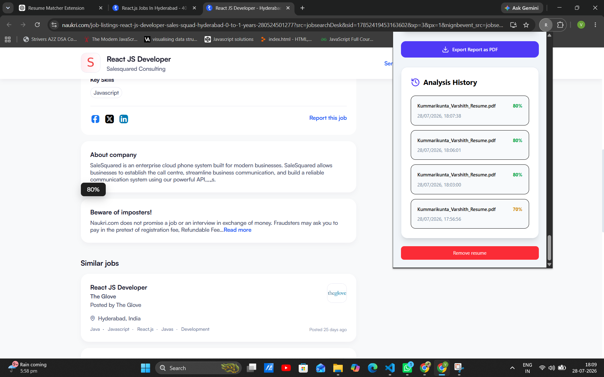
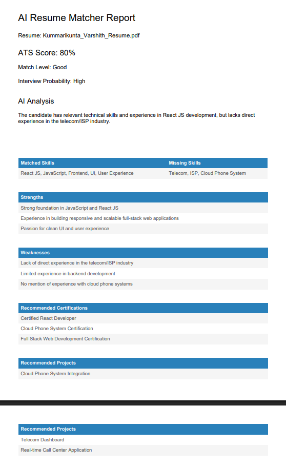

<div align="center">

# 🚀 AI Resume Matcher Chrome Extension

### AI-powered ATS Resume Analyzer built with React, Chrome Extension, Express & Groq AI

Compare your Resume against any Job Description and instantly receive an ATS score, interview probability, strengths, weaknesses, skill gaps, AI suggestions, certification recommendations, portfolio project ideas, and a downloadable PDF report.

</div>

<p align="center">


</p>

## 🎬 Demo

<p align="center">


</p>

# 📸 Screenshots

## Upload Resume



---

## ATS Dashboard



---

## Keyword Analysis



---

## Recommended Projects



---

## Analysis History



---

## PDF Report



# 🏗 Architecture

```text
                +-----------------------+
                |   Chrome Extension    |
                |  (React + Tailwind)   |
                +-----------+-----------+
                            |
                            |
                            v
                 Background Service Worker
                            |
                            |
                            v
                 Express.js Backend API
                            |
            Parse Resume PDF using pdf-parse
                            |
                            v
                 Groq AI (Llama 3.3 70B)
                            |
        ATS Analysis • Keywords • Suggestions
                            |
                            v
                 JSON Response to Extension
                            |
                            v
        Beautiful ATS Dashboard + PDF Export
```
# ✨ Features

| Feature | Status |
|----------|--------|
| Upload Resume PDF | ✅ |
| ATS Score | ✅ |
| Keyword Analysis | ✅ |
| Match Breakdown | ✅ |
| Resume Strengths | ✅ |
| Resume Weaknesses | ✅ |
| Interview Probability | ✅ |
| AI Suggestions | ✅ |
| Recommended Certifications | ✅ |
| Recommended Projects | ✅ |
| PDF Report Export | ✅ |
| Analysis History | ✅ |
| Chrome Extension | ✅ |

# 🛠 Tech Stack

| Frontend | Backend | AI | Browser |
|-----------|----------|-----|----------|
| React | Express | Groq | Chrome Extension |
| Tailwind CSS | Node.js | Llama 3.3 70B | Manifest V3 |
| Framer Motion | pdf-parse | ATS Analysis | Chrome Storage |
| Lucide Icons | REST API | JSON Output | Content Scripts |

AI-Resume-Matcher-Chrome-Extension
│
├── backend
│
├── public
│
├── src
│   ├── components
│   │
│   ├── UploadCard.jsx
│   ├── ScoreCard.jsx
│   ├── MatchBreakdown.jsx
│   ├── KeywordSection.jsx
│   ├── StrengthCard.jsx
│   ├── WeaknessCard.jsx
│   ├── InterviewCard.jsx
│   ├── SuggestionCard.jsx
│   ├── CertificationCard.jsx
│   ├── ProjectCard.jsx
│   ├── ExportReportButton.jsx
│   └── HistoryCard.jsx
│
└── README.md

# 🚀 Roadmap

- [x] AI ATS Score
- [x] Keyword Matching
- [x] Resume Analysis
- [x] Chrome Extension
- [x] PDF Report
- [x] Analysis History

## Coming Soon

- [ ] Resume Comparison
- [ ] Cover Letter Generator
- [ ] AI Resume Rewrite
- [ ] Job Tracker
- [ ] Multi Resume Management
- [ ] AI Career Roadmap

---

## 👨‍💻 Author

**Varshith Kummarikunta**

GitHub:
https://github.com/Varshith-kummarikunta

---

⭐ If you found this project useful, please give it a Star.